# Go (basics) + Notion

Building a Go program to fill in two columns of a Notion table I used to
type by hand. It is the first Go I have written.

Almost nothing in it failed loudly. Every real bug was the program
finishing successfully while being wrong.

The code this post describes lives at
[github.com/siddhant-angore/go-tools](https://github.com/siddhant-angore/go-tools).

---

I keep eleven mutual funds in a Notion table. Every column in it was right except two: the price of each fund, and the date that price was published. Those two I typed in by hand, most evenings, reading them off my broker's app.

This is the log of writing a Go program to stop doing that. It is the first Go I have written. Almost nothing in it failed loudly. Every real bug was the program finishing successfully while being wrong.

## I paid $166 to host a private notebook

Before Notion I self-hosted a full stack application. It tracked my investments, along with everything else I wanted online. I ran it for about six months.

Then the [Fly.io](http://Fly.io) bill arrived. $166.20.

I went and looked at what I had actually built. Ninety-seven percent of it was never meant to be seen by anyone but me. I had been paying public hosting rates to run a private notebook.

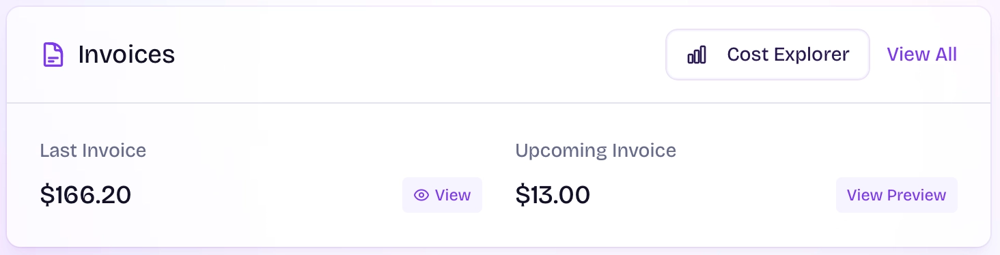

So I went back to Notion on the Plus plan, $12 a month. Cheaper than the server, and I stopped redesigning it every two weeks.

> **Work out who the audience is before you pay for the infrastructure.**

---

## What has to exist by the end

- A Notion table holding what I own and what I paid for it.

- A Go program that fills in the two columns I was typing by hand.

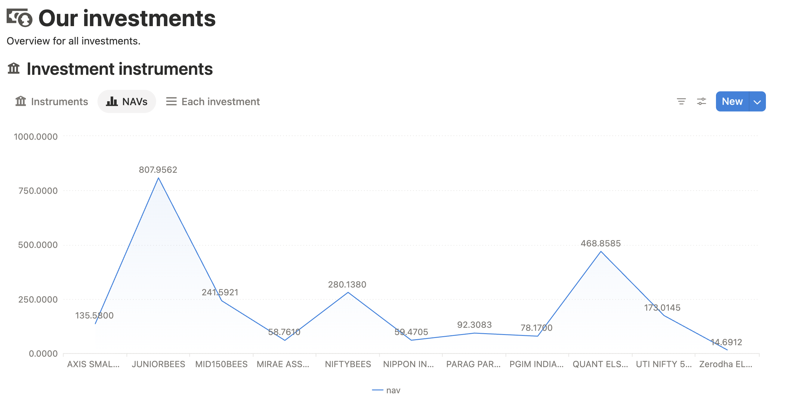

---

## The shape of the table decides the shape of the program

Two tables. One row per fund I hold, one row per transaction. The Go program only ever writes to the first table, and only ever to two of its columns.

### One row per fund I own

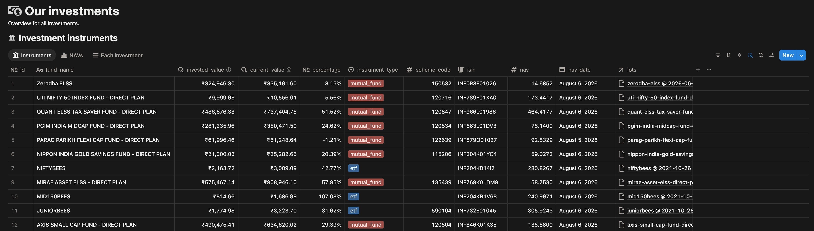

Three fields are facts I type in once:

1. **Fund name** (`fund_name`)

2. **ISIN** (`isin`) is **required to fetch corresponding NAV.**

3. **Scheme code** (`scheme_code`) is AMFI's own numbering. I keep the column and the program never reads it. There is a section further down about why.

Everything below is worked out by Notion, not by me:

1. **Invested value** (`invested_value`) is calculated by summing the each investment lot under this instrument.

    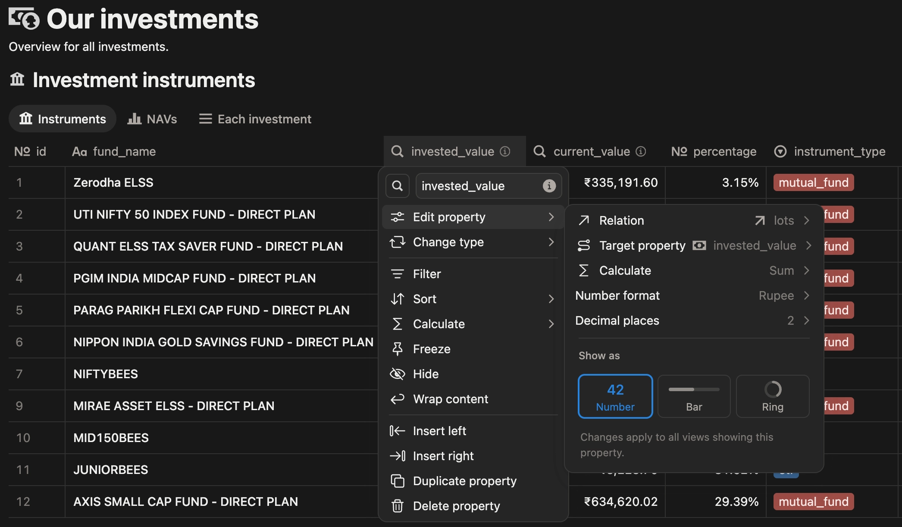

2. **Current value** (`current_value`) is calculated by getting the total units accumulated under this instrument multiplied by their latest NAV (Net Asset Value).

    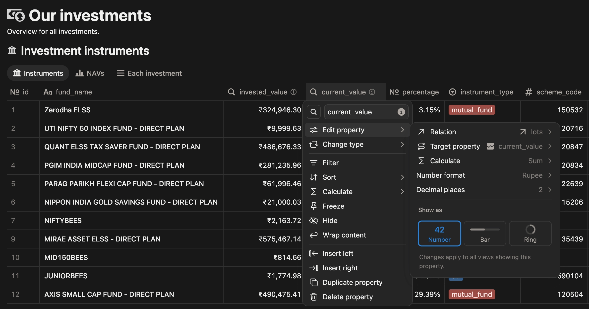

3. **Percentage** (`percentage`) shows by how much percent the instrument has grown. `((currentValue - investedValue)/investedValue)*100`

    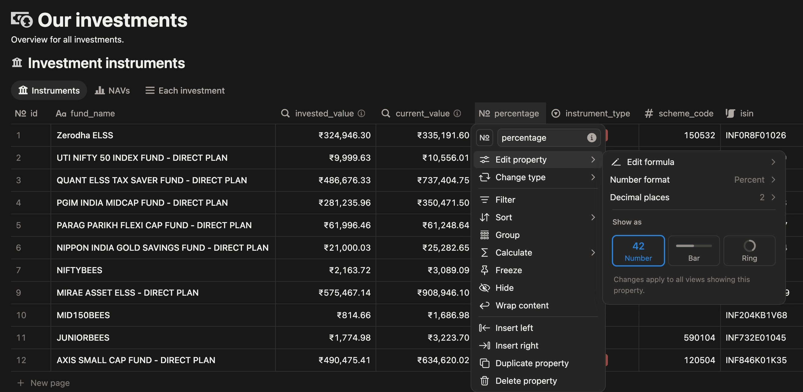

4. **NAV** (`nav`) and **NAV Date** (`nav_date`) come from AMFI. These two are the only things the Go program writes. Every number above them is built on top of these.

---

### One row per transaction

The second table records each purchase: which fund, how many units, at what price. One fund collects many of these rows over time.

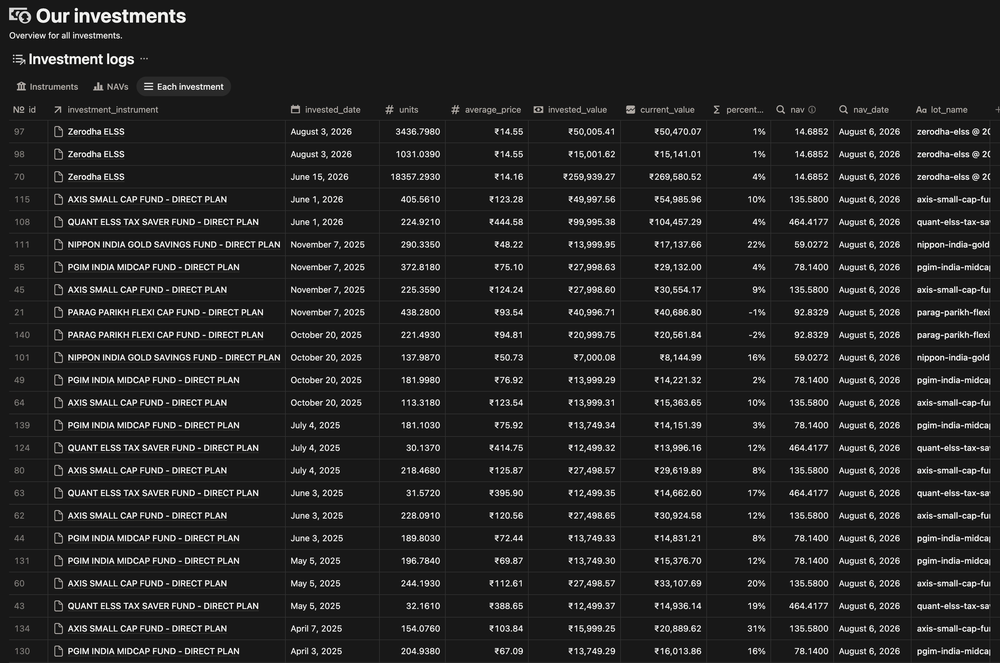

Four fields matter:

1. **Instrument** (`investment_instrument`) in which we are investing. This is related to the `Instrument` table. `Each investment` will have a relation with `Instrument`, only one instrument can be selected for an investment.

    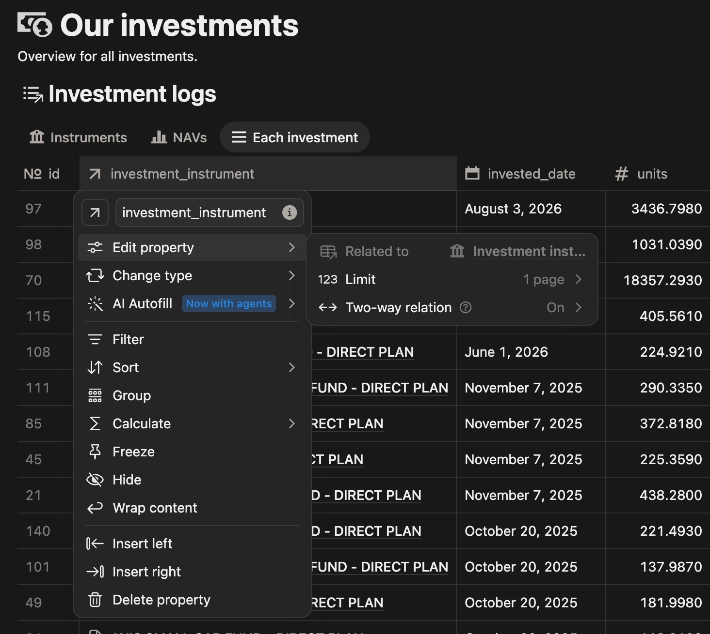

2. **Date** (`nav_date`) `Rollup`

    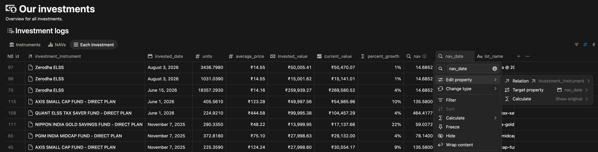

3. **Units allotted** (`units`) `number`

4. **Average price** (`average_price`) `number`

The rest are calculated. None of them are needed for the program to run.

1. **Invested value** (`invested_value`) is just **units allotted** x **average price**.

    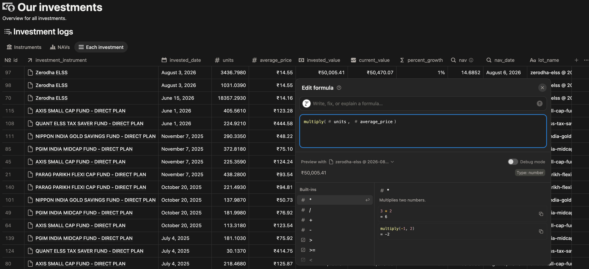

2. **Current value** (`current_value`) is just **units allotted** x **NAV**.

    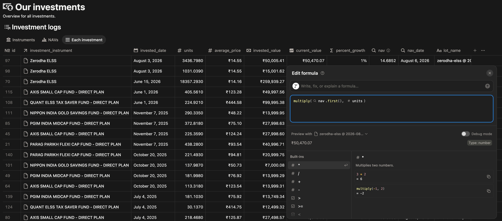

3. **Percentage** (`percentage_growth`) by how much percent the instrument has grown. `((currentValue - investedValue)/investedValue)*100`

    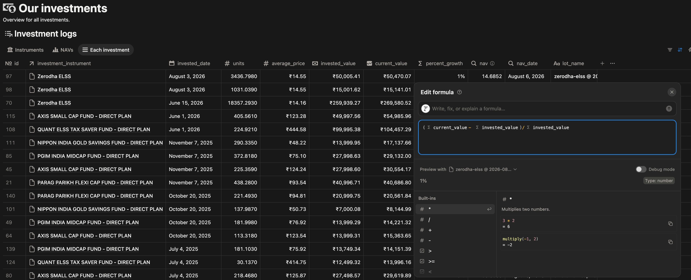

4. **NAV** (`nav`) & **NAV Date** (`nav_date`) are fetched from the real time source.* *But for this DB we will be just getting them from `Instruments` table.

    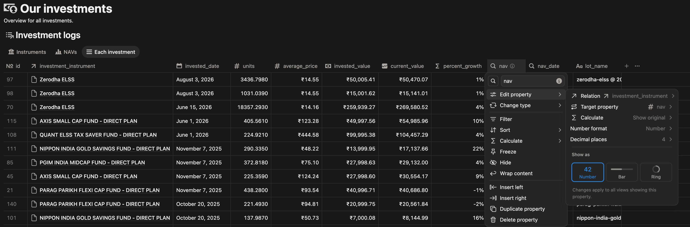
    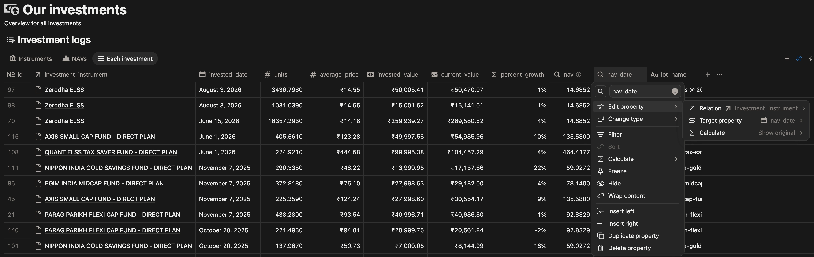

Two fields I have not mentioned:

1. `lot_name`: As every Notion DB requires a title you can have anything in this, it is *not important*.

2. `lots`: Relates to the `Lots`/`Logs`/`Each investment` DB whatever you have named it.

    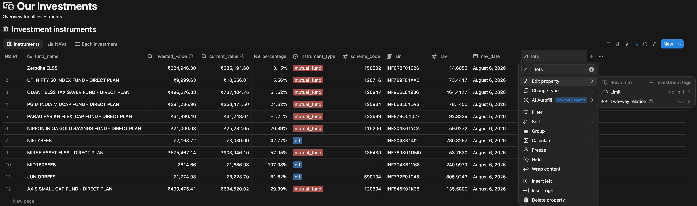

> That is the whole schema. Change it to fit your own holdings. Only `isin`, `nav` and `nav_date` matter to the code.

---

## Ninety seconds of setup, then the interesting part

I am on macOS with Homebrew. [go.dev](https://go.dev) covers everything else.

```bash
brew install go
# siddhant@SiddhantA-TAG-1024 ~ % brew install go
# ✔︎ JSON API packages.arm64_tahoe.jws.json                                                                                                                                                                                                                                                           Downloaded   15.6MB/ 15.6MB
# Warning: go 1.26.5 is already installed and up-to-date.
# To reinstall 1.26.5, run:
#   brew reinstall go
# siddhant@SiddhantA-TAG-1024 ~ % brew reinstall go
# ==> Would reinstall 1 formula:
# go
# ==> Downloading https://ghcr.io/v2/homebrew/core/go/manifests/1.26.5
# Already downloaded: /Users/siddhant/Library/Caches/Homebrew/downloads/7c2dbcd14e6f8c2bd28d5bd77268cefabc6a6f4c95e7d21386953b257d64176b--go-1.26.5.bottle_manifest.json
# ==> Fetching downloads for: go
# ✔︎ Bottle go (1.26.5)                                                                                                                                                                                                                                                                               Downloaded   64.1MB/ 64.1MB
# ==> Reinstalling go
# ==> Pouring go--1.26.5.arm64_tahoe.bottle.tar.gz
# 🍺  /opt/homebrew/Cellar/go/1.26.5: 14,965 files, 228.7MB
# ==> Running `brew cleanup go`...
# Disable this behaviour by setting `HOMEBREW_NO_INSTALL_CLEANUP=1`.
# Hide these hints with `HOMEBREW_NO_ENV_HINTS=1` (see `man brew`).

go version # go version go1.26.5 darwin/arm64

mkdir notion_tools
cd notion_tools

go mod init notion_tools # go: creating new go.mod: module notion_tools
```

---

### Two things Go insists on before it will run anything

```go
package main

import (
    "fmt"
)

func main() {
    fmt.Println("Hello world!")
}
```

Output:

```bash
siddhant@SiddhantA-TAG-1024 notion_tools % go run main.go

Hello world!
```

> In Go, this starts with `package main` this is equivalent of saying *“build an executable”, *it’s the only package name that produces something runnable, and it must contain `func main()` for an entry point.

`fmt` is the standard library's formatted I/O. `Printf`, `Println`, and the rest.

---

### The first five lines contained no data

The NAVs come from one file: [AMFI's NAVAll.txt](https://www.amfiindia.com/spages/NAVAll.txt). One GET request, plain text back.

Two packages do the work. `net/http` makes the request. `bufio` reads the reply one line at a time, which matters more than it sounds. The response is not a document. It is an open pipe of bytes, and the network has no idea where my lines end.

So let’s write this code:

```go
package main

import (
    "bufio"    // Buffered I/O
    "fmt"      // Formatted I/O
    "log"      // Output with timestamps, logs to stderr
    "net/http" // Network
)

func main() {
    // Go has no throw/catch. A function that can fail returns what you
    // wanted AND what went wrong, side by side. The cost is three extra
    // lines everywhere; the benefit is that every failure point is
    // visible at the call site and cannot silently jump up the stack.
    res, err := http.Get("https://www.amfiindia.com/spages/NAVAll.txt")

    // err must be checked BEFORE touching res, because res is
    // meaningless when err is non-nil. Reading res
    // first simply does not make sense.
    if err != nil {
        log.Fatal(err)
    }

    // The network response is not a document/object, but a stream of bytes. It's an open pipe.
    // When http.Get returns, the stream is open and must be closed when we are done with it.
    // A connection is limited resource, and if you leak it, your program will eventually run out of connections and fail.
    // The idiomatic way to ensure that the stream is closed is to schedule it with defer immediately after the error check.
    defer res.Body.Close()

    // The network has no concept of a line.
    //
    // TCP delivers arbitrary blobs. One packet might carry two & a half lines;
    // one line might extend across three packets.
    // res.Body is bytes with no structure at all.
    // The bufio package provides a buffered reader that can read lines from a stream of bytes.
    //
    // bufio.NewScanner returns a scanner that reads from res.Body.
    // The scanner has a buffer and can read lines from the stream.
    //
    // It accepts any io.Reader, so same line works against a file, a string, or a network stream / response.
    scanner := bufio.NewScanner(res.Body)

    countLines := 0

    // Parsing a stream is a loop. The scanner reads a line, and the loop body processes it.
    for scanner.Scan() {
        countLines++
        if countLines <= 5 {
            // Text() returns the current line as string without the newline character.
            // The scanner keeps the line in memory until the next Scan() call.
            fmt.Println(scanner.Text())
        }
    }

    // HINT: bufio.Scanner "scanner" is used in Scan loop at line 48 without final check of scanner.Err()
    // This is a common mistake. The scanner may have failed to read the stream, and the loop will exit without any indication of failure.
    // To check this, call scanner.Err() after the loop. If it returns non-nil, the scanner failed to read the stream.
    if err := scanner.Err(); err != nil {
        log.Fatal(err)
    }

    fmt.Println("Total lines: ", countLines)
}

```

```bash
siddhantangore@Siddhants-MacBook-Pro go-tools % go run instrument_data_source/main.go
Scheme Code;ISIN Div Payout/ ISIN Growth;ISIN Div Reinvestment;Scheme Name;Net Asset Value;Date

Open Ended Schemes(Debt Scheme - Banking and PSU Fund)

Aditya Birla Sun Life Mutual Fund
Total lines:  17734
```

Read those five lines again. A header row. A blank line. A category heading. Another blank line. The name of an AMC.

Not one of them is a fund. I had asked a data file for its first five lines and received five lines of furniture.

Seventeen thousand lines in that file, and the top of it is not the shape of the rest of it.

---

## Telling the data from the furniture

Let's create a structure for this:

```go
type NAV struct {
    Name  string // field 3
    Value string // field 4
    Date  string // field 5
}
```

Three fields, all strings. The `Value` being a string will look wrong to you. Hold that thought, I'll come back to it.

### The signature matters more than the body

```go
func parseNAVs(r io.Reader) (map[string]NAV, error)
```

The obvious thing to write here is `parseNAVs(url string)`. Give it the AMFI link, get back NAVs. I didn't, and this turned out to be the single most useful decision in the whole program.

`io.Reader` is Go's interface for "something you can read bytes from". A network response is one. A file is one. A plain string is one. So this one function works against all three:

```go
parseNAVs(res.Body)                        // live from AMFI
parseNAVs(f)                               // a saved copy on disk
parseNAVs(strings.NewReader(sampleData))   // a test fixture
```

Fetching and parsing are two different jobs. A parser that reaches out to the network is a parser you can't test, and one you can't run fifty times while debugging without hammering someone else's server.

The map key is the ISIN, not the scheme code. More on why in a later section. That decision cost me an hour.

### Guard 1: the obvious one

```go
fields := strings.Split(scanner.Text(), ";")

if len(fields) < 6 {
    continue
}
```

`Aditya Birla Sun Life Mutual Fund` has no semicolons. Neither does `Open Ended Schemes(Debt Scheme - Banking and PSU Fund)`, nor the blank lines. All of them collapse to fewer than six fields and get dropped here.

I thought that was the whole filter. It isn't.

### Guard 2: the line that shouldn't have survived

Look at the header row again:

```plain text
Scheme Code;ISIN Div Payout/ ISIN Growth;ISIN Div Reinvestment;Scheme Name;Net Asset Value;Date
```

Six fields. Semicolon separated. Structurally identical to real data. It walks straight past Guard 1 and lands in my map with the literal string `Net Asset Value` sitting where a number should be.

The instinct is to blacklist it: skip any line starting with `Scheme Code`. That handles the one piece of junk I'd already seen, and nothing else.

Instead, validate what a real row must be. Field 0 is always a numeric scheme code:

```go
if _, err := strconv.Atoi(strings.TrimSpace(fields[0])); err != nil {
    continue
}
```

One check, and every non-data line disappears at once. The header, the AMC names, the category headings, and whatever shape AMFI decides to add next year that I have never laid eyes on.

> **Don't enumerate what to reject. Validate what you want.**

A blacklist only knows about the junk you've already met. A whitelist covers the junk you haven't.

### Trim everything

```go
nav := NAV{
    Name:  strings.TrimSpace(fields[3]),
    Value: strings.TrimSpace(fields[4]),
    Date:  strings.TrimSpace(fields[5]),
}
```

The file carries stray whitespace in places you won't see. An untrimmed `" INF846K01CR6"` compares unequal to `"INF846K01CR6"` and your lookup silently misses. No error, just a fund that quietly never updates.

### The ISIN is in two columns

This one I could not have guessed. Look at these two rows from the extract:

```plain text
120438;INF846K01CR6;-;Axis Banking & PSU Debt Fund - Direct Plan - Growth Option;2893.3294;04-Aug-2026
120437;-;INF846K01CU0;Axis Banking & PSU Debt Fund - Direct Plan - Daily IDCW;1039.1310;04-Aug-2026
```

Field 1 is the payout/growth ISIN. Field 2 is the reinvestment ISIN. **Either one can be a dash.** The first row has its ISIN in field 1. The second has it in field 2.

Check only field 1 and you silently lose every fund of the second kind. So index both, pointing at the same record:

```go
for _, index := range []int{1, 2} {
    isin := strings.TrimSpace(fields[index])
    if isin == "" || isin == "-" {
        continue
    }
    navs[isin] = nav
}
```

Now a lookup by either ISIN finds the same NAV.

### Why Value is still a string

Back to the thing I asked you to hold.

It's tempting to call `strconv.ParseFloat` right here and store a `float64`. I don't, for one reason: some schemes publish `N.A.` instead of a number, and a parser that dies on one bad row gives you nothing at all.

There's a related detail hiding in the extract, if you look at the dates:

```plain text
128952;INF846K01NF8;-;Axis Banking & PSU Debt Fund - Direct Plan - Bonus Option;1532.8272;14-Jun-2017
```

A NAV from 2017, sitting in today's file. Dead schemes don't get removed. They stop updating. This is exactly why I keep the date as a field rather than assuming everything in the file is current.

So the parser stays dumb. It reads what the file says and hands it over intact. Deciding what `N.A.` means, or whether a 2017 date is acceptable, belongs to the code that knows what the data is *for*, not to the code that reads bytes.

> **Parsers should be boring. Judgement belongs upstream.**

### One last line

```go
return navs, scanner.Err()
```

Same lesson as the previous section, one layer up. `scanner.Scan()` returning false means the loop ended. It does not mean the loop succeeded. A connection that dies at line 8,000 exits this loop in exactly the same way a clean EOF does, and without `Err()` you'd return a half-built map and call it a day.

---

## Nine in, six out

The parser gives me 17,953 ISINs. I own eleven funds. So the next job is a filter and this is where the program started lying to me.

### A set, not a list

Go has no set type, so the idiom is a map with a throwaway value:

```go
mySchemeCodes := map[string]bool{
    "150532": true,
    "120716": true,
    "120847": true,
    // ... six more
}
```

A slice would work too, but then every one of the 17,953 rows means walking the whole list looking for a match. A map lookup is a single hash, no matter how many funds I hold.

There's a second reason a map is nice here, and it's a Go quirk worth knowing. Looking up a missing key doesn't error. It returns the *zero value* for the type. For a `bool`, that's `false`. So this needs no "does it contain" check at all:

```go
if mySchemeCodes[code] {
    navs[code] = nav
}
```

The 17,942 funds I don't own return `false` and fall through. Convenient here. It will bite me in about ninety seconds.

### The run that looked fine

Nine scheme codes in. Six lines out.

```plain text
120847 464.4152
122639 93.3575
120834 105.4054
120504 55.66
150532 16.2321
120716 173.2932
```

No error. No warning. Exit status zero.

I stared at this for a while before I noticed the count. Three of my funds were absent, and the program was entirely happy about it.

That's worse than a crash. A crash is a message - it tells you where and when. This told me nothing. Scheduled daily and running unattended, three funds would have carried a stale NAV forever, and I'd have found out weeks later when the portfolio total looked slightly wrong, with no idea when it started going wrong.

Remember the zero-value convenience from a minute ago? That's the mechanism. A missing key returns `false` instead of complaining, so "I don't own this fund" and "this fund isn't in the file" produce identical behaviour. The language handed me silence and I accepted it.

### Making the program admit it

The fix is four lines, and it doesn't fix anything:

```go
for code := range mySchemeCodes {
    if _, ok := navs[code]; !ok {
        log.Printf("warning: no NAV found for scheme %s", code)
    }
}
```

```plain text
2026/08/05 22:27:03 warning: no NAV found for scheme 115206
2026/08/05 22:27:03 warning: no NAV found for scheme 135439
2026/08/05 22:27:03 warning: no NAV found for scheme 590104
```

Two things going on in those four lines.

`if _, ok := navs[code]; !ok` is the **comma-ok idiom**. Map lookups in Go can return a second value: `true` if the key was present, `false` if you got a zero value instead. It's the only way to tell "absent" from "present but empty" - and that ambiguity was the bug.

More importantly, this loop iterates over `mySchemeCodes`, not `navs`. Every version before it looped over what it *found*. This one loops over what it *wanted*.

> **A program that only reports what it got cannot tell you what it lost.**

The program now knows its own intent. It can be disappointed.

### But why were they missing?

A warning you don't act on is worse than no warning, so: three funds, three questions. I stopped guessing and looked at the raw data.

```bash
curl -s https://www.amfiindia.com/spages/NAVAll.txt -o navall.txt
grep -i "parag parikh" navall.txt
```

The fund was right there. Correct name, live NAV, updated that morning. Its scheme code just wasn't the number I had.

I'd copied those codes out of my broker's website. They were the broker's own internal IDs! not AMFI scheme codes at all. The data was never missing. My key was wrong.

> **When two datasets won't join, suspect your key before you suspect the data.**

### The identifier that was on my statement the whole time

The right key is the `ISIN`, and it was sitting on my consolidated account statement in plain text. No transcription, no guessing.

It's also a better identifier on the merits. ISIN is a global standard, it survives fund renames and AMC mergers, whereas scheme codes are AMFI's internal numbering and do get reassigned. If the point of this program is to still be correct in two years, that difference matters.

Eleven `ISINs` in. Eleven NAVs out. No warnings.

```plain text
INF204KB1V68 241.9442 05-Aug-2026
INF769K01DM9  58.7610 05-Aug-2026
INF663L01DV3  78.1800 04-Aug-2026
...
```

Which is why the parser back in the last section indexes by ISIN and checks both columns for it. That decision looks obvious written down. It cost me an hour and three silent failures to arrive at.

### One more thing hiding in that output

Look at the dates. `05-Aug` on some rows, `04-Aug` on others, in a single fetch, from a single file.

AMFI publishes as each AMC reports, so the file is never uniformly current. Which means *"is this file from today?" *has no answer. Only individual rows do.

Full code till now:

```go
package main

import (
    "bufio" // Buffered I/O
    "fmt"   // Formatted I/O
    "io"
    "log"      // Output with timestamps, logs to stderr
    "net/http" // Network
    "strconv"
    "strings"
)

const amfiNAVURL = "https://www.amfiindia.com/spages/NAVAll.txt"

func main() {
    // Go has no throw/catch. A function that can fail returns what you
    // wanted AND what went wrong, side by side. The cost is three extra
    // lines everywhere; the benefit is that every failure point is
    // visible at the call site and cannot silently jump up the stack.
    res, err := http.Get("https://www.amfiindia.com/spages/NAVAll.txt")

    // err must be checked BEFORE touching res, because res is
    // meaningless when err is non-nil. Reading res
    // first simply does not make sense.
    if err != nil {
        log.Fatal(err)
    }

    // The network response is not a document/object, but a stream of bytes. It's an open pipe.
    // When http.Get returns, the stream is open and must be closed when we are done with it.
    // A connection is limited resource, and if you leak it, your program will eventually run out of connections and fail.
    // The idiomatic way to ensure that the stream is closed is to schedule it with defer immediately after the error check.
    defer res.Body.Close()

    // The network has no concept of a line.
    //
    // TCP delivers arbitrary blobs. One packet might carry two & a half lines;
    // one line might extend across three packets.
    // res.Body is bytes with no structure at all.
    // The bufio package provides a buffered reader that can read lines from a stream of bytes.
    //
    // bufio.NewScanner returns a scanner that reads from res.Body.
    // The scanner has a buffer and can read lines from the stream.
    //
    // It accepts any io.Reader, so same line works against a file, a string, or a network stream / response.
    // scanner := bufio.NewScanner(res.Body)

    // countLines := 0

    // Funds that I hold, keyed by ISIN. This is a map of string to bool struct.
    myISINs := map[string]bool{
        "INF0R8F01026": true,
        "INF789F01XA0": true,
        "INF966L01986": true,
        "INF663L01DV3": true,
        "INF879O01027": true,
        "INF204K01YC4": true,
        "INF204KB14I2": true,
        "INF769K01DM9": true,
        "INF204KB1V68": true,
        "INF732E01045": true,
        "INF846K01K35": true,
    }

    all, err := fetchNAVs(amfiNAVURL)
    if err != nil {
        log.Fatal(err)
    }
    log.Printf("Parsed %d ISINs from AMFI.", len(all))

    // Keeping only what I hold, and printing the NAVs for those ISINs.
    mine := make(map[string]NAV)
    for isin := range myISINs {
        if nav, ok := all[isin]; ok {
            mine[isin] = nav
        }
    }

    for isin, nav := range mine {
        fmt.Printf("%s %-45s %10s %s\n", isin, nav.Name, nav.Value, nav.Date)
    }

    // Every loop before this one iterated over what was FOUND. This one
    // iterates over what was WANTED. Without it, a fund that silently
    // vanishes from the file looks exactly like a successful run.
    for isin := range myISINs {
        if _, ok := mine[isin]; !ok {
            log.Printf("Warning: No NAV found for %s", isin)
        }
    }

    // Parsing a stream is a loop. The scanner reads a line, and the loop body processes it.
    // for scanner.Scan() {
    //     countLines++
    //     if countLines <= 5 {
    //         // Text() returns the current line as string without the newline character.
    //         // The scanner keeps the line in memory until the next Scan() call.
    //         fmt.Println(scanner.Text())
    //     }
    // }

    // // HINT: bufio.Scanner "scanner" is used in Scan loop at line 48 without final check of scanner.Err()
    // // This is a common mistake. The scanner may have failed to read the stream, and the loop will exit without any indication of failure.
    // // To check this, call scanner.Err() after the loop. If it returns non-nil, the scanner failed to read the stream.
    // if err := scanner.Err(); err != nil {
    //     log.Fatal(err)
    // }

    // fmt.Println("Total lines: ", countLines)
}

// NAV is one scheme's published net asset value.
//
// Value stays a string on purpose: some schemes publish "N.A." instead
// of a number, and a parser that dies on one bad row gives you nothing.
// Date is kept because the file is not uniformly current — dead schemes
// sit in it for years with their last published NAV.
type NAV struct {
    Name  string // field 3
    Value string // field 4
    Date  string // field 5
}

// parseNAVs reads AMFI's semicolon-delimited report from any source.
//
// Taking an io.Reader rather than a URL means this same function works
// against a live response, a file saved to disk, or a string literal in
// a test. Fetching and parsing are separate jobs.
func parseNAVs(r io.Reader) (map[string]NAV, error) {
    navs := make(map[string]NAV)
    scanner := bufio.NewScanner(r)

    for scanner.Scan() {
        // We will be splitting the line into fields using the semicolon ";" as the delimiter.
        fields := strings.Split(scanner.Text(), ";")

        // Instrument's name has no semicolons, as these are human readable in response.
        // We will add a guard here to ensure that we have at least 6 fields, as we are interested in fields 3, 4, and 5.
        if len(fields) < 6 {
            continue
        }

        // The header row passes the guard, but we don't want to include it in the map. We will skip it by checking if the first field is "Scheme Code".
        // Scheme code is a number, so we can use strconv.Atoi to check if it is a number. If it is not a number, we will skip the row.
        if _, err := strconv.Atoi(strings.TrimSpace(fields[0])); err != nil {
            continue
        }

        // Creating the NAV struct with the required fields. We will trim the whitespace from the fields to ensure that we have clean data.
        nav := NAV{
            Name:  strings.TrimSpace(fields[3]),
            Value: strings.TrimSpace(fields[4]),
            Date:  strings.TrimSpace(fields[5]),
        }

        // There are two ISINs for each fund, one for growth and one for dividend.
        // Indexing both ISINs in the map, so that we can look up the NAV by either ISIN.
        for _, index := range []int{1, 2} {
            isin := strings.TrimSpace(fields[index])
            if isin == "" || isin == "-" {
                continue
            }
            navs[isin] = nav
        }
    }

    return navs, scanner.Err()
}

func fetchNAVs(url string) (map[string]NAV, error) {
    res, err := http.Get(url)
    if err != nil {
        return nil, err
    }
    defer res.Body.Close()

    return parseNAVs(res.Body)
}

```

```bash
siddhantangore@Siddhants-MacBook-Pro go-tools % go run instrument_data_source/main.go

2026/08/07 19:28:56 Parsed 17960 ISINs from AMFI.
INF879O01027 Parag Parikh Flexi Cap Fund - Direct Plan - Growth    92.3083 06-Aug-2026
INF204KB14I2 Nippon India ETF Nifty 50 BeES                  280.8267 06-Aug-2026
INF204KB1V68 Nippon India ETF Nifty Midcap 150               240.9971 06-Aug-2026
INF0R8F01026 Zerodha ELSS Tax Saver Nifty LargeMidcap 250 Index Fund - Direct Plan - Growth option    14.6852 06-Aug-2026
INF789F01XA0 UTI Nifty 50 Index Fund - Growth Option- Direct   173.4417 06-Aug-2026
INF663L01DV3 PGIM India Midcap Fund - Direct Plan - Growth Option      78.14 06-Aug-2026
INF204K01YC4 Nippon India Gold Savings Fund - Direct Plan Growth Plan - Growth Option    59.0272 06-Aug-2026
INF769K01DM9 Mirae Asset ELSS Tax Saver Fund - Direct Plan - Growth     58.753 06-Aug-2026
INF732E01045 Nippon India ETF Nifty Next 50 Junior BeES      805.9243 06-Aug-2026
INF846K01K35 Axis Small Cap Fund - Direct Plan - Growth        135.58 06-Aug-2026
INF966L01986 quant ELSS Tax Saver Fund - Growth Option - Direct Plan   464.4177 06-Aug-2026
```

---

## Reading was the hard half

I can now get eleven NAVs from AMFI. They need to end up in my Notion table. This section is about the half of that job I did not expect to be hard: reading.

### What Notion actually is

I had been thinking of my portfolio table as a database. It looks like one. It has columns and rows.

It is not one. There is no SQL. I cannot say "update the row where isin is `INF789F01XA0`".

Underneath, Notion is a store of pages. Every row in my table is a page with its own ID, a long string like `32c673ae-bc7c-7b63-1b6a-8d5617d4e1d7`. To change something, I have to name the exact page I want changed.

Think of it like posting a letter. You cannot address it to "the blue house on the corner". You need the street address. Notion will not look up a row by its contents for me. It only accepts page IDs.

This gives me the shape of the whole job, before I write any code:

1. Ask Notion for my rows.

2. For each row, note the ISIN and the page ID.

3. Match those ISINs against the NAVs from AMFI.

4. Write back, one page at a time, using the IDs.

I cannot write until I have read. So reading comes first.

### Getting permission

Notion does not hand out access to anything by default. Two steps:

1. Create an internal integration at [https://app.notion.com/developers/connections](https://app.notion.com/developers/connections). This gives you a token, a long secret string.

    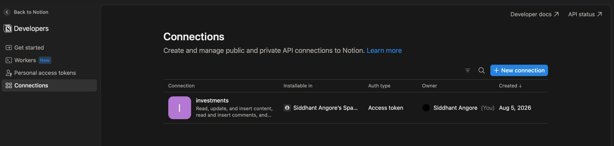

2. Open your database, go to Connections, and add that integration.

    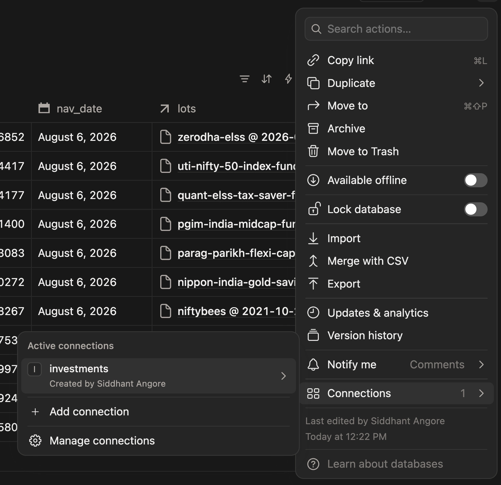

Step 2 is the one people skip, and it catches nearly everyone. Without it the token is valid but the database is invisible. You get a clean response with zero results, which looks a lot like an empty database.

The token goes in an environment variable, never in the source file:

```go
token := os.Getenv("NOTION_TOKEN")
if token == "" {
    log.Fatal("NOTION_TOKEN not set")
}
```

I am going to push this repo to GitHub and write about it. A secret in a public repo gets found by scrapers within hours. Better to build the habit now, while there is only one line to change.

### Look before you write

Before writing any Go, I sent one request by hand:

```bash
curl -X POST 'https://api.notion.com/v1/data_sources/YOUR_ID/query' \
  -H 'Authorization: Bearer YOUR_TOKEN' \
  -H 'Notion-Version: 2025-09-03' \
  -H 'Content-Type: application/json' \
  -d '{"page_size": 3}'
```

This is worth doing every time you meet a new API. Writing code against JSON you have not seen is guessing. Guessing costs an hour. Curl costs a minute.

### The shape of the answer

Here is the reply, with almost everything stripped out:

```json
{
  "results": [
    {
      "id": "32c673ae-bc7c-7b63-1b6a-8d5617d4e1d7",
      "properties": {
        "isin": {
          "type": "rich_text",
          "rich_text": [
            { "plain_text": "INF789F01XA0" }
          ]
        }
      }
    }
  ],
  "has_more": true,
  "next_cursor": "s:c1d0a4b7-91e2-44f8..."
}
```

The two things I need are the `id` at the top and the ISIN buried five levels down. The real response is roughly forty times longer than this. Every column comes back with its own type, colour, internal ID and formatting flags.

Notice that `rich_text` is a list, not a string. In Notion a text cell can hold several runs of text with different styling. Even a plain cell comes back as a list with one item in it.

### Taking only what you need

In Go, you describe the JSON you care about as a struct. Anything you do not describe is ignored:

```go
type Page struct {
    ID         string `json:"id"`
    Properties struct {
        ISIN struct {
            RichText []struct {
                PlainText string `json:"plain_text"`
            } `json:"rich_text"`
        } `json:"isin"`
    } `json:"properties"`
}
```

Those backtick strings are struct tags. They say "this Go field comes from that JSON key". Without them Go would look for a JSON key called `PlainText`, which does not exist.

It reads like a lot of nesting, but every level matches one level in the JSON above. `properties`, then `isin`, then `rich_text`, then the first item, then `plain_text`. Once you see that, reading any Notion response becomes mechanical.

And this is the useful part: I described four fields out of maybe two hundred. Go silently drops the rest. My code does not break when Notion adds a new field, because my code never claimed to know about it.

### The typo that compiled

I wrote this:

```go
} `json:"rich_text`
```

Look closely. The closing quote is missing.

It compiled. It ran. No error, no warning, nothing.

Struct tags are just strings as far as the Go compiler is concerned. It never checks whether they are well formed, and it never checks whether they match anything. So the tag failed to match `rich_text`, every row came back with an empty list, my code skipped all of them, and the program cheerfully told me it had found zero rows.

That would have cost me an hour of staring at the wrong thing. Go ships a tool that finds it in under a second:

```bash
go vet ./...
```

`go vet` catches malformed struct tags, print statements whose arguments do not match, unreachable code, and a pile of similar things. All of them compile. None of them are what you meant.

> **The compiler proves your code is valid. It does not prove it is correct.**

I now run `go vet` before every commit.

### The rows I could not see

Look at the last two lines of that JSON again:

```json
"has_more": true,
"next_cursor": "s:c1d0a4b7-91e2-44f8..."
```

Notion never sends the whole table. It sends at most 100 rows, then tells you there is more and hands you a bookmark.

One request looks completely successful. Status 200, valid JSON, rows in it. It is just not all of them.

This is the same shape of problem as the three missing funds from the last section. Nothing failed. The data was incomplete, and only the small print said so.

The fix is a loop. Keep asking until Notion says there is nothing left:

```go
for {
    // ... send the request, with start_cursor if we have one

    if !page.HasMore {
        break
    }
    cursor = page.NextCursor
}
```

Eleven rows fit in one page, so this does nothing for me today. It will matter the first time I hold more than a hundred funds, and by then I will have long forgotten this detail. Write it once, while you are reading the docs and it is in front of you.

> **Handle the second page on the day you write the first request.**

### Two columns I am not allowed to touch

Something else showed up in the full response. My `invested_amount` column is a formula. My units column is a rollup. Both come back with values, and both are read only. Notion works them out and refuses any attempt to write to them.

At first this looked like a limitation. It is actually the best design decision in the project, and I did not make it.

Think about a calculator. The display shows a number. You do not write on the display. You change what you typed in, and the display follows.

Notion is telling me the same thing. Some columns are inputs. Some are displays. Only inputs can be written.

So my program writes two things and nothing else: the NAV, and the date that NAV was published. Current value becomes a Notion formula, NAV multiplied by units. Profit becomes another formula on top of that.

If my Go program had calculated current value and written it, that number would be a snapshot of one moment. Change the units in Notion tomorrow and the stored value would be silently wrong, still sitting there looking authoritative.

> **Store the facts. Calculate everything else at the moment you look at it.**

Facts are what you were told. Everything else is a conclusion, and conclusions go stale.

### The same fund, twice

I stored the result as a map from ISIN to page ID:

```go
rows := make(map[string]string)
rows[isin] = pageID
```

Then I noticed one of my funds updating in Notion and its twin sitting there untouched. I hold the same Mirae fund under two different investors, so it appears on two rows.

A map holds one value per key. The second row quietly overwrote the first. No error. Go will not warn you that you just threw something away.

The bug was not really in the code. It was in the shape I chose. `map[string]string` states, as a fact, that one ISIN has one page. That was never true.

The fix is to make the shape honest:

```go
rows := make(map[string][]string)
rows[isin] = append(rows[isin], pageID)
```

One ISIN, many pages. Which is what my portfolio actually looks like.

> **Ask whether two things could share a key before you reach for a map.**

If they can, and you use a plain map anyway, you have chosen to lose data without being told.

### Where this leaves me

I can now read my portfolio out of Notion and get back a list of ISINs, each with every page ID that holds it. I have NAVs from AMFI keyed the same way. The two halves fit together.

All that is left is to write. Which sounds like the small part, and was not, because AMFI publishes dates in a format Notion refuses to accept, and Go parses dates in a way that is unlike any language I have used.

Full code:

```go
package main

import (
    "bufio" // Buffered I/O
    "bytes"
    "encoding/json"
    "fmt" // Formatted I/O
    "io"
    "log"      // Output with timestamps, logs to stderr
    "net/http" // Network
    "os"
    "strconv"
    "strings"
)

const (
    amfiNAVURL    = "https://www.amfiindia.com/spages/NAVAll.txt"
    notionVersion = "2025-09-03"
)

func main() {

    // Go has no throw/catch. A function that can fail returns what you
    // wanted AND what went wrong, side by side. The cost is three extra
    // lines everywhere; the benefit is that every failure point is
    // visible at the call site and cannot silently jump up the stack.
    // res, err := http.Get("https://www.amfiindia.com/spages/NAVAll.txt")

    // err must be checked BEFORE touching res, because res is
    // meaningless when err is non-nil. Reading res
    // first simply does not make sense.
    // if err != nil {
    //     log.Fatal(err)
    // }

    // The network response is not a document/object, but a stream of bytes. It's an open pipe.
    // When http.Get returns, the stream is open and must be closed when we are done with it.
    // A connection is limited resource, and if you leak it, your program will eventually run out of connections and fail.
    // The idiomatic way to ensure that the stream is closed is to schedule it with defer immediately after the error check.
    // defer res.Body.Close()

    // The network has no concept of a line.
    //
    // TCP delivers arbitrary blobs. One packet might carry two & a half lines;
    // one line might extend across three packets.
    // res.Body is bytes with no structure at all.
    // The bufio package provides a buffered reader that can read lines from a stream of bytes.
    //
    // bufio.NewScanner returns a scanner that reads from res.Body.
    // The scanner has a buffer and can read lines from the stream.
    //
    // It accepts any io.Reader, so same line works against a file, a string, or a network stream / response.
    // scanner := bufio.NewScanner(res.Body)

    // countLines := 0

    // Funds that I hold, keyed by ISIN. This is a map of string to bool struct.
    // myISINs := map[string]bool{
    //     "INF0R8F01026": true,
    //     "INF789F01XA0": true,
    //     "INF966L01986": true,
    //     "INF663L01DV3": true,
    //     "INF879O01027": true,
    //     "INF204K01YC4": true,
    //     "INF204KB14I2": true,
    //     "INF769K01DM9": true,
    //     "INF204KB1V68": true,
    //     "INF732E01045": true,
    //     "INF846K01K35": true,
    // }

    token := os.Getenv("NOTION_TOKEN")
    if token == "" {
        log.Fatal("NOTION_TOKEN not set.")
    }
    dataSourceID := os.Getenv("NOTION_DATA_SOURCE_ID")
    if dataSourceID == "" {
        log.Fatal("NOTION_DATA_SOURCE_ID not set.")
    }

    rows, err := fetchNotionRows(token, dataSourceID)
    if err != nil {
        log.Fatal(err)
    }

    pageCount := 0
    for _, ids := range rows {
        pageCount += len(ids)
    }
    log.Printf("Found %d pages across %d ISINs in Notion", pageCount, len(rows))

    navs, err := fetchNAVs(amfiNAVURL)
    if err != nil {
        log.Fatal(err)
    }
    log.Printf("Parsed %d ISINs from AMFI.", len(navs))

    for isin, pageIDs := range rows {
        nav, ok := navs[isin]
        if !ok {
            log.Printf("Warning: No NAV for %s", isin)
            continue
        }
        for _, pageID := range pageIDs {
            fmt.Printf("%s %-45s %10s %s %s\n", isin, nav.Name, nav.Value, nav.Date, pageID)
        }
    }

    // Keeping only what I hold, and printing the NAVs for those ISINs.
    // mine := make(map[string]NAV)
    // for isin := range myISINs {
    //     if nav, ok := all[isin]; ok {
    //         mine[isin] = nav
    //     }
    // }

    // for isin, nav := range mine {
    //     fmt.Printf("%s %-45s %10s %s\n", isin, nav.Name, nav.Value, nav.Date)
    // }

    // Every loop before this one iterated over what was FOUND. This one
    // iterates over what was WANTED. Without it, a fund that silently
    // vanishes from the file looks exactly like a successful run.
    // for isin := range myISINs {
    //     if _, ok := mine[isin]; !ok {
    //         log.Printf("Warning: No NAV found for %s", isin)
    //     }
    // }

    // Parsing a stream is a loop. The scanner reads a line, and the loop body processes it.
    // for scanner.Scan() {
    //     countLines++
    //     if countLines <= 5 {
    //         // Text() returns the current line as string without the newline character.
    //         // The scanner keeps the line in memory until the next Scan() call.
    //         fmt.Println(scanner.Text())
    //     }
    // }

    // // HINT: bufio.Scanner "scanner" is used in Scan loop at line 48 without final check of scanner.Err()
    // // This is a common mistake. The scanner may have failed to read the stream, and the loop will exit without any indication of failure.
    // // To check this, call scanner.Err() after the loop. If it returns non-nil, the scanner failed to read the stream.
    // if err := scanner.Err(); err != nil {
    //     log.Fatal(err)
    // }

    // fmt.Println("Total lines: ", countLines)
}

// NAV is one scheme's published net asset value.
//
// Value stays a string on purpose: some schemes publish "N.A." instead
// of a number, and a parser that dies on one bad row gives you nothing.
// Date is kept because the file is not uniformly current — dead schemes
// sit in it for years with their last published NAV.
type NAV struct {
    Name  string // field 3
    Value string // field 4
    Date  string // field 5
}

// parseNAVs reads AMFI's semicolon-delimited report from any source.
//
// Taking an io.Reader rather than a URL means this same function works
// against a live response, a file saved to disk, or a string literal in
// a test. Fetching and parsing are separate jobs.
func parseNAVs(r io.Reader) (map[string]NAV, error) {
    navs := make(map[string]NAV)
    scanner := bufio.NewScanner(r)

    for scanner.Scan() {
        // We will be splitting the line into fields using the semicolon ";" as the delimiter.
        fields := strings.Split(scanner.Text(), ";")

        // Instrument's name has no semicolons, as these are human readable in response.
        // We will add a guard here to ensure that we have at least 6 fields, as we are interested in fields 3, 4, and 5.
        if len(fields) < 6 {
            continue
        }

        // The header row passes the guard, but we don't want to include it in the map. We will skip it by checking if the first field is "Scheme Code".
        // Scheme code is a number, so we can use strconv.Atoi to check if it is a number. If it is not a number, we will skip the row.
        if _, err := strconv.Atoi(strings.TrimSpace(fields[0])); err != nil {
            continue
        }

        // Creating the NAV struct with the required fields. We will trim the whitespace from the fields to ensure that we have clean data.
        nav := NAV{
            Name:  strings.TrimSpace(fields[3]),
            Value: strings.TrimSpace(fields[4]),
            Date:  strings.TrimSpace(fields[5]),
        }

        // There are two ISINs for each fund, one for growth and one for dividend.
        // Indexing both ISINs in the map, so that we can look up the NAV by either ISIN.
        for _, index := range []int{1, 2} {
            isin := strings.TrimSpace(fields[index])
            if isin == "" || isin == "-" {
                continue
            }
            navs[isin] = nav
        }
    }

    return navs, scanner.Err()
}

func fetchNAVs(url string) (map[string]NAV, error) {
    res, err := http.Get(url)
    if err != nil {
        return nil, err
    }
    defer res.Body.Close()

    return parseNAVs(res.Body)
}

// QueryResponse is Notion's reply to a data source query.
//
// Notion sends at most 100 rows at a time. HasMore and NextCursor are
// how it tells you there is more, and where to carry on from.
type QueryResponse struct {
    Results    []Page `json:"results"`
    HasMore    bool   `json:"has_more"`
    NextCursor string `json:"next_cursor"`
}

// Page is one row of the table.
//
// The real response carries around two hundred fields per row. This
// describes four of them. Go ignores everything it was not told about,
// so this code does not break when Notion adds something new.
//
// Note that rich_text is a list. A Notion text cell can hold several
// runs of differently styled text, so even a plain cell arrives as a
// list with one item in it.
type Page struct {
    ID         string `json:"id"`
    Properties struct {
        ISIN struct {
            RichText []struct {
                PlainText string `json:"plain_text"`
            } `json:"rich_text"`
        } `json:"isin"`
    } `json:"properties"`
}

// notionRequest builds a request with the three headers every Notion
// call needs. One function owns this so the API version string exists
// in exactly one place.
func notionRequest(method, url, token string, body []byte) (*http.Request, error) {
    var reader io.Reader
    if body != nil {
        reader = bytes.NewReader(body)
    }

    req, err := http.NewRequest(method, url, reader)
    if err != nil {
        return nil, err
    }
    req.Header.Set("Authorization", "Bearer "+token)
    req.Header.Set("Notion-Version", notionVersion)
    req.Header.Set("Content-Type", "application/json")

    return req, nil
}

// fetchNotionRows returns every ISIN in the table, along with every
// page that holds it.
//
// The value is a slice, not a single string. I hold the same fund under
// two investors, so one ISIN can appear on several rows. A plain
// map[string]string would keep the last one and silently drop the rest.
func fetchNotionRows(token, dataSourceID string) (map[string][]string, error) {
    rows := make(map[string][]string)
    url := "https://api.notion.com/v1/data_sources/" + dataSourceID + "/query"
    cursor := ""

    for {
        body := map[string]any{"page_size": 100}

        // start_cursor is left out entirely on the first request.
        // Sending it as an empty string is an error.
        if cursor != "" {
            body["start_cursor"] = cursor
        }

        payload, err := json.Marshal(body)
        if err != nil {
            return nil, err
        }

        req, err := notionRequest("POST", url, token, payload)
        if err != nil {
            return nil, err
        }

        res, err := http.DefaultClient.Do(req)
        if err != nil {
            return nil, err
        }

        // Notion sends its refusal in the response body.
        if res.StatusCode != http.StatusOK {
            msg, _ := io.ReadAll(res.Body)
            res.Body.Close()
            return nil, fmt.Errorf("Notion query returned %d: %s", res.StatusCode, msg)
        }

        var page QueryResponse
        err = json.NewDecoder(res.Body).Decode(&page)

        // Not using defer here because, defer is tied to a function.
        // Inside a loop they are not the same. Hence, not using defer here.
        res.Body.Close()
        if err != nil {
            return nil, err
        }

        for _, p := range page.Results {
            // A row with empty ISIN has an empty list
            if len(p.Properties.ISIN.RichText) == 0 {
                continue
            }

            // A cell holding only whitespace trims to "". Without this it
            // becomes a map key and reappears later as a warning about a
            // fund with no name.
            isin := strings.TrimSpace(p.Properties.ISIN.RichText[0].PlainText)
            if isin == "" || isin == "-" {
                continue
            }
            rows[isin] = append(rows[isin], p.ID)
        }

        // Notion sends 100 rows at a time. Stop only when it says so.
        if !page.HasMore {
            break
        }
        cursor = page.NextCursor
    }

    return rows, nil
}

```

```bash
siddhantangore@Siddhants-MacBook-Pro go-tools % go run instrument_data_source/main.go

2026/08/07 23:50:54 Found 11 pages across 11 ISINs in Notion
2026/08/07 23:50:54 Parsed 17960 ISINs from AMFI.
INF846K01K35 Axis Small Cap Fund - Direct Plan - Growth        135.58 07-Aug-2026 269b2c97-160b-4303-b007-737848af564e
INF769K01DM9 Mirae Asset ELSS Tax Saver Fund - Direct Plan - Growth     58.761 07-Aug-2026 7bd06ad4-7e67-ca21-7312-65a7a5f3f345
INF663L01DV3 PGIM India Midcap Fund - Direct Plan - Growth Option      78.17 07-Aug-2026 22252b29-5398-ca55-3b32-7ae90a0c7014
INF966L01986 quant ELSS Tax Saver Fund - Growth Option - Direct Plan   468.8585 07-Aug-2026 59197683-9bad-ef2a-ce60-c07e83affae2
INF789F01XA0 UTI Nifty 50 Index Fund - Growth Option- Direct   173.0145 07-Aug-2026 aa1c4623-18b4-2fcc-26ee-df5a5e9f166c
INF0R8F01026 Zerodha ELSS Tax Saver Nifty LargeMidcap 250 Index Fund - Direct Plan - Growth option    14.6912 07-Aug-2026 3e2b118a-0131-3a09-0f7c-ddee56a67630
INF732E01045 Nippon India ETF Nifty Next 50 Junior BeES      807.9562 07-Aug-2026 2396dc5b-b085-e302-6802-4f41183f6747
INF204KB1V68 Nippon India ETF Nifty Midcap 150               241.5921 07-Aug-2026 1f52cb6a-52c8-230e-b082-ca3b09b59061
INF204KB14I2 Nippon India ETF Nifty 50 BeES                  280.1380 07-Aug-2026 675c62f9-68fb-35e5-4634-aeb3b0d3534a
INF204K01YC4 Nippon India Gold Savings Fund - Direct Plan Growth Plan - Growth Option    59.4705 07-Aug-2026 3d513207-a858-b3f9-5876-2b8f970bea40
INF879O01027 Parag Parikh Flexi Cap Fund - Direct Plan - Growth    92.3083 06-Aug-2026 52797dc9-1123-fd13-2864-a57c47697d34
```

---

## Now the actual point of the program

Everything so far has been reading. Now the actual point of the program: put the numbers into Notion.

### The request

One PATCH per page. Same three headers as before. The body says which properties to change and nothing else:

```json
{
  "properties": {
    "nav": { "number": 173.3618 },
    "nav_date": { "date": { "start": "2026-08-05" } }
  }
}
```

Notice each property is wrapped in its type. A number goes inside `{"number": ...}`. A date goes inside `{"date": {"start": ...}}`. Notion needs to know what kind of thing you are handing it, because a text column and a number column accept completely different shapes.

Anything you leave out is left alone. This is a patch, not a replacement. My other nine columns are untouched.

I tested it on one page first, with the values typed in by hand. Then I watched the cell change in my browser. That was the moment this stopped feeling like an exercise.

### Read the refusal

One thing saved me a lot of time here:

```go
if res.StatusCode != http.StatusOK {
    msg, _ := io.ReadAll(res.Body)
    return fmt.Errorf("notion returned %d: %s", res.StatusCode, msg)
}
```

When Notion says no, it says why. The body of a 400 tells you exactly which property was wrong. Throwing that away leaves you with "400 Bad Request", which tells you nothing, and twenty minutes of guessing at column names.

My first failure was a capital letter in a property name. The message named the property. Without the body I would have been rereading the docs.

> **When an API refuses, read the refusal.**

### Two conversions in the way

The NAV I have is the string `"173.3618"`. Notion wants a number. That conversion is one line:

```go
value, err := strconv.ParseFloat(nav.Value, 64)
```

The date is where it got strange. AMFI publishes `05-Aug-2026`. Notion needs `2026-08-05`.

### The bug that made no sense

I wrote the conversion, ran it, and every single row failed:

```plain text
Skipping INF204K01YC4: bad date "05-Aug-2026"
Skipping INF204KB1V68: bad date "05-Aug-2026"
Skipping INF846K01K35: bad date "05-Aug-2026"
... eleven of them
```

Before doing anything else, look at what that tells you. **All eleven failed, identically.** Bad data would spare at least some rows. When every input fails the same way, the input is not the problem.

The other clue is the `%q` in my log line. That prints a string with quotes around it, so I could see there was no hidden whitespace, no stray newline, nothing odd. The string was clean. The code was wrong.

So I put the error itself in the message, which I should have done from the start:

```go
log.Printf("skipping %s: bad date %q: %v", isin, nav.Date, err)
```

And Go told me exactly what was wrong:

```plain text
parsing time "05-Aug-2026" as "02-Jan-2026": cannot parse "" as "6"
```

Read the second string. That is my layout. I had written `2026`. It should have been `2006`.

> **Never log about an error without logging the error.**

### Why 2006

Every language does date formats differently. Most use codes. In Python it is `%d-%b-%Y`. In Java it is `dd-MMM-yyyy`. You memorise which letter means what, and you look it up every time anyway.

Go does something else. You write out one specific date as an example, and Go reads your example to work out the format you want.

That date is always the same one:

```plain text
Mon Jan 2 15:04:05 MST 2006
```

Which is 01/02 03:04:05 PM 2006, with the parts numbered 1 through 7 in order. Month is 1, day is 2, hour is 3, minute is 4, second is 5, year is 6, timezone is 7. It is a mnemonic.

So `02-Jan-2006` means: two digit day, three letter month, four digit year. Which matches `05-Aug-2026`.

The catch is that these numbers are the language. `2006` means "a four digit year goes here". `2026` does not mean anything, so Go treated it as literal text to match.

That is exactly what the error described, once I could read it. Go matched the literal characters `202` against the start of my input `2026`. Then it reached the `6` in my layout and read that as the code for a one or two digit year. But my input was already used up, so it got an empty string. Hence `"cannot parse empty string as 6"`.

The error was precise. I just did not know the language yet.

One character fixed it:

```go
t, err := time.Parse("02-Jan-2006", nav.Date)
iso := t.Format("2006-01-02")
```

Same reference date, used twice. Once to describe the format coming in, once to describe the format going out.

### One bad row must not kill the run

This is the difference between a script and a job.

My instinct on any error was `log.Fatal`, which prints and exits. That is fine while you are developing. It is wrong for something that runs unattended.

If one fund publishes `N.A.` instead of a number, I still want the other ten updated. Failing everything because of one bad row is worse than useless:

```go
value, err := strconv.ParseFloat(nav.Value, 64)
if err != nil {
    log.Printf("skipping %s: bad NAV %q: %v", isin, nav.Value, err)
    failed++
    continue
}
```

`continue`, not `Fatal`. Do as much as you can. Report what you could not.

> **A batch job should finish its work, then tell you what it missed.**

### The last line matters more than it looks

At the end, one summary and one exit code:

```go
log.Printf("Done in %s: %d updated, %d failed",
    time.Since(start).Round(time.Millisecond), updated, failed)

if failed > 0 {
    os.Exit(1)
}
```

Those three lines are what make this scheduleable.

A scheduler does not read your logs. It reads the exit code. Zero means success, anything else means failure. If my program exits zero after failing four writes, every monitor watching it reports healthy forever, and nobody ever tells me.

This is the same idea as the missing funds two sections ago, and the same idea as checking `scanner.Err()` in the first one. Something has to notice, and it has to say so in a way that something else can hear.

### It works

```plain text
2026/08/08 01:25:48 Found 11 pages across 11 ISINs in Notion
2026/08/08 01:25:49 Parsed 17960 ISINs from AMFI.
INF846K01K35 Axis Small Cap Fund - Direct Plan - Growth        135.58 07-Aug-2026 269b2c97-160b-4303-b007-737848af564e
INF789F01XA0 UTI Nifty 50 Index Fund - Growth Option- Direct   173.0145 07-Aug-2026 aa1c4623-18b4-2fcc-26ee-df5a5e9f166c
...
2026/08/08 01:25:55 Done in 8.109s: 11 updated, 0 failed
```

Eleven pages across eleven ISINs on this run, one to one. The value in that map is still a slice, and that is the point: whether an ISIN maps to one page or to three, this loop does not change. That was a story from the last section.

Then I added a formula column in Notion: NAV multiplied by units. My actual portfolio value, worked out by Notion, from a number my program put there.

That is the whole thing working, end to end, for the first time.

### The eight seconds

Look at the timing though. Eight seconds for eleven small writes.

Read the timestamps. The Notion query and the whole AMFI file take one second between them, 01:25:48 to 01:25:49. The remaining six are eleven round trips to Notion's servers, one after another, a bit over half a second each.

Waiting. Not calculating. For six of those eight seconds my computer is doing nothing at all except holding the line.

That is the next section.

Full code:

```go
package main

import (
    "bufio" // Buffered I/O
    "bytes"
    "encoding/json"
    "fmt" // Formatted I/O
    "io"
    "log"      // Output with timestamps, logs to stderr
    "net/http" // Network
    "os"
    "strconv"
    "strings"
    "time"
)

const (
    amfiNAVURL    = "https://www.amfiindia.com/spages/NAVAll.txt"
    notionVersion = "2025-09-03"
)

func main() {

    // Go has no throw/catch. A function that can fail returns what you
    // wanted AND what went wrong, side by side. The cost is three extra
    // lines everywhere; the benefit is that every failure point is
    // visible at the call site and cannot silently jump up the stack.
    // res, err := http.Get("https://www.amfiindia.com/spages/NAVAll.txt")

    // err must be checked BEFORE touching res, because res is
    // meaningless when err is non-nil. Reading res
    // first simply does not make sense.
    // if err != nil {
    //     log.Fatal(err)
    // }

    // The network response is not a document/object, but a stream of bytes. It's an open pipe.
    // When http.Get returns, the stream is open and must be closed when we are done with it.
    // A connection is limited resource, and if you leak it, your program will eventually run out of connections and fail.
    // The idiomatic way to ensure that the stream is closed is to schedule it with defer immediately after the error check.
    // defer res.Body.Close()

    // The network has no concept of a line.
    //
    // TCP delivers arbitrary blobs. One packet might carry two & a half lines;
    // one line might extend across three packets.
    // res.Body is bytes with no structure at all.
    // The bufio package provides a buffered reader that can read lines from a stream of bytes.
    //
    // bufio.NewScanner returns a scanner that reads from res.Body.
    // The scanner has a buffer and can read lines from the stream.
    //
    // It accepts any io.Reader, so same line works against a file, a string, or a network stream / response.
    // scanner := bufio.NewScanner(res.Body)

    // countLines := 0

    // Funds that I hold, keyed by ISIN. This is a map of string to bool struct.
    // myISINs := map[string]bool{
    //     "INF0R8F01026": true,
    //     "INF789F01XA0": true,
    //     "INF966L01986": true,
    //     "INF663L01DV3": true,
    //     "INF879O01027": true,
    //     "INF204K01YC4": true,
    //     "INF204KB14I2": true,
    //     "INF769K01DM9": true,
    //     "INF204KB1V68": true,
    //     "INF732E01045": true,
    //     "INF846K01K35": true,
    // }

    start := time.Now()

    token := os.Getenv("NOTION_TOKEN")
    if token == "" {
        log.Fatal("NOTION_TOKEN not set.")
    }
    dataSourceID := os.Getenv("NOTION_DATA_SOURCE_ID")
    if dataSourceID == "" {
        log.Fatal("NOTION_DATA_SOURCE_ID not set.")
    }

    rows, err := fetchNotionRows(token, dataSourceID)
    if err != nil {
        log.Fatal(err)
    }

    pageCount := 0
    for _, ids := range rows {
        pageCount += len(ids)
    }
    log.Printf("Found %d pages across %d ISINs in Notion", pageCount, len(rows))

    navs, err := fetchNAVs(amfiNAVURL)
    if err != nil {
        log.Fatal(err)
    }
    log.Printf("Parsed %d ISINs from AMFI.", len(navs))

    updated, failed := 0, 0

    for isin, pageIDs := range rows {
        nav, ok := navs[isin]
        if !ok {
            log.Printf("Warning: No NAV for %s", isin)
            failed += len(pageIDs)
            continue
        }

        value, err := strconv.ParseFloat(nav.Value, 64)
        if err != nil {
            log.Printf("Skipping %s: Bad NAV %q: %v", isin, nav.Value, err)
            failed += len(pageIDs)
            continue
        }

        t, err := time.Parse("02-Jan-2006", nav.Date)
        if err != nil {
            log.Printf("Skipping %s: Bad Date %q: %v", isin, nav.Date, err)
            failed += len(pageIDs)
            continue
        }
        isoDate := t.Format("2006-01-02")

        for _, pageID := range pageIDs {
            if err := updateNAV(token, pageID, value, isoDate); err != nil {
                log.Printf("Failed %s (%s): %v", isin, pageID, err)
                failed++
                continue
            }
            updated++
            fmt.Printf("%s %-45s %10s %s %s\n", isin, nav.Name, nav.Value, nav.Date, pageID)
        }
    }

    log.Printf("Done in %s: %d updated, %d failed", time.Since(start).Round(time.Millisecond), updated, failed)

    if failed > 0 {
        os.Exit(1)
    }

    // Keeping only what I hold, and printing the NAVs for those ISINs.
    // mine := make(map[string]NAV)
    // for isin := range myISINs {
    //     if nav, ok := all[isin]; ok {
    //         mine[isin] = nav
    //     }
    // }

    // for isin, nav := range mine {
    //     fmt.Printf("%s %-45s %10s %s\n", isin, nav.Name, nav.Value, nav.Date)
    // }

    // Every loop before this one iterated over what was FOUND. This one
    // iterates over what was WANTED. Without it, a fund that silently
    // vanishes from the file looks exactly like a successful run.
    // for isin := range myISINs {
    //     if _, ok := mine[isin]; !ok {
    //         log.Printf("Warning: No NAV found for %s", isin)
    //     }
    // }

    // Parsing a stream is a loop. The scanner reads a line, and the loop body processes it.
    // for scanner.Scan() {
    //     countLines++
    //     if countLines <= 5 {
    //         // Text() returns the current line as string without the newline character.
    //         // The scanner keeps the line in memory until the next Scan() call.
    //         fmt.Println(scanner.Text())
    //     }
    // }

    // // HINT: bufio.Scanner "scanner" is used in Scan loop at line 48 without final check of scanner.Err()
    // // This is a common mistake. The scanner may have failed to read the stream, and the loop will exit without any indication of failure.
    // // To check this, call scanner.Err() after the loop. If it returns non-nil, the scanner failed to read the stream.
    // if err := scanner.Err(); err != nil {
    //     log.Fatal(err)
    // }

    // fmt.Println("Total lines: ", countLines)
}

// NAV is one scheme's published net asset value.
//
// Value stays a string on purpose: some schemes publish "N.A." instead
// of a number, and a parser that dies on one bad row gives you nothing.
// Date is kept because the file is not uniformly current — dead schemes
// sit in it for years with their last published NAV.
type NAV struct {
    Name  string // field 3
    Value string // field 4
    Date  string // field 5
}

// parseNAVs reads AMFI's semicolon-delimited report from any source.
//
// Taking an io.Reader rather than a URL means this same function works
// against a live response, a file saved to disk, or a string literal in
// a test. Fetching and parsing are separate jobs.
func parseNAVs(r io.Reader) (map[string]NAV, error) {
    navs := make(map[string]NAV)
    scanner := bufio.NewScanner(r)

    for scanner.Scan() {
        // We will be splitting the line into fields using the semicolon ";" as the delimiter.
        fields := strings.Split(scanner.Text(), ";")

        // Instrument's name has no semicolons, as these are human readable in response.
        // We will add a guard here to ensure that we have at least 6 fields, as we are interested in fields 3, 4, and 5.
        if len(fields) < 6 {
            continue
        }

        // The header row passes the guard, but we don't want to include it in the map. We will skip it by checking if the first field is "Scheme Code".
        // Scheme code is a number, so we can use strconv.Atoi to check if it is a number. If it is not a number, we will skip the row.
        if _, err := strconv.Atoi(strings.TrimSpace(fields[0])); err != nil {
            continue
        }

        // Creating the NAV struct with the required fields. We will trim the whitespace from the fields to ensure that we have clean data.
        nav := NAV{
            Name:  strings.TrimSpace(fields[3]),
            Value: strings.TrimSpace(fields[4]),
            Date:  strings.TrimSpace(fields[5]),
        }

        // There are two ISINs for each fund, one for growth and one for dividend.
        // Indexing both ISINs in the map, so that we can look up the NAV by either ISIN.
        for _, index := range []int{1, 2} {
            isin := strings.TrimSpace(fields[index])
            if isin == "" || isin == "-" {
                continue
            }
            navs[isin] = nav
        }
    }

    return navs, scanner.Err()
}

func fetchNAVs(url string) (map[string]NAV, error) {
    res, err := httpClient.Get(url)
    if err != nil {
        return nil, err
    }
    defer res.Body.Close()

    // A non-2xx is not a transport error. The request succeeded, the
    // server just said no. Without this check an HTML error page parses
    // cleanly to zero rows and the program reports success.
    if res.StatusCode != http.StatusOK {
        return nil, fmt.Errorf("AMFI returned %d", res.StatusCode)
    }

    return parseNAVs(res.Body)
}

// QueryResponse is Notion's reply to a data source query.
//
// Notion sends at most 100 rows at a time. HasMore and NextCursor are
// how it tells you there is more, and where to carry on from.
type QueryResponse struct {
    Results    []Page `json:"results"`
    HasMore    bool   `json:"has_more"`
    NextCursor string `json:"next_cursor"`
}

// Page is one row of the table.
//
// The real response carries around two hundred fields per row. This
// describes four of them. Go ignores everything it was not told about,
// so this code does not break when Notion adds something new.
//
// Note that rich_text is a list. A Notion text cell can hold several
// runs of differently styled text, so even a plain cell arrives as a
// list with one item in it.
type Page struct {
    ID         string `json:"id"`
    Properties struct {
        ISIN struct {
            RichText []struct {
                PlainText string `json:"plain_text"`
            } `json:"rich_text"`
        } `json:"isin"`
    } `json:"properties"`
}

// notionRequest builds a request with the three headers every Notion
// call needs. One function owns this so the API version string exists
// in exactly one place.
func notionRequest(method, url, token string, body []byte) (*http.Request, error) {
    var reader io.Reader
    if body != nil {
        reader = bytes.NewReader(body)
    }

    req, err := http.NewRequest(method, url, reader)
    if err != nil {
        return nil, err
    }
    req.Header.Set("Authorization", "Bearer "+token)
    req.Header.Set("Notion-Version", notionVersion)
    req.Header.Set("Content-Type", "application/json")

    return req, nil
}

// fetchNotionRows returns every ISIN in the table, along with every
// page that holds it.
//
// The value is a slice, not a single string. I hold the same fund under
// two investors, so one ISIN can appear on several rows. A plain
// map[string]string would keep the last one and silently drop the rest.
func fetchNotionRows(token, dataSourceID string) (map[string][]string, error) {
    rows := make(map[string][]string)
    url := "https://api.notion.com/v1/data_sources/" + dataSourceID + "/query"
    cursor := ""

    for {
        body := map[string]any{"page_size": 100}

        // start_cursor is left out entirely on the first request.
        // Sending it as an empty string is an error.
        if cursor != "" {
            body["start_cursor"] = cursor
        }

        payload, err := json.Marshal(body)
        if err != nil {
            return nil, err
        }

        req, err := notionRequest("POST", url, token, payload)
        if err != nil {
            return nil, err
        }

        res, err := httpClient.Do(req)
        if err != nil {
            return nil, err
        }

        // Notion sends its refusal in the response body.
        if res.StatusCode != http.StatusOK {
            msg, _ := io.ReadAll(res.Body)
            res.Body.Close()
            return nil, fmt.Errorf("Notion query returned %d: %s", res.StatusCode, msg)
        }

        var page QueryResponse
        err = json.NewDecoder(res.Body).Decode(&page)

        // Not using defer here because, defer is tied to a function.
        // Inside a loop they are not the same. Hence, not using defer here.
        res.Body.Close()
        if err != nil {
            return nil, err
        }

        for _, p := range page.Results {
            // A row with empty ISIN has an empty list
            if len(p.Properties.ISIN.RichText) == 0 {
                continue
            }

            // A cell holding only whitespace trims to "". Without this it
            // becomes a map key and reappears later as a warning about a
            // fund with no name.
            isin := strings.TrimSpace(p.Properties.ISIN.RichText[0].PlainText)
            if isin == "" || isin == "-" {
                continue
            }
            rows[isin] = append(rows[isin], p.ID)
        }

        // Notion sends 100 rows at a time. Stop only when it says so.
        if !page.HasMore {
            break
        }
        cursor = page.NextCursor
    }

    return rows, nil
}

// One shared client for every request in the program.
//
// It holds the connection pool, so repeated calls to Notion reuse the
// same TCP and TLS connection instead of negotiating a new one each
// time. It also carries a deadline, which the default client does not
// have at all. Without one, a server that accepts the connection and
// then stalls hangs this program forever.
var httpClient = &http.Client{
    Timeout: 30 * time.Second,
}

// updateNAVs writes 2 properties to 1 page.
//
// This is a PATCH, not a replacement.
func updateNAV(token, pageID string, nav float64, isoDate string) error {
    // Each value is wrapped in a property type, because a number & date column
    // accept different shapes
    body := map[string]any{
        "properties": map[string]any{
            "nav": map[string]any{"number": nav},
            "nav_date": map[string]any{
                "date": map[string]any{"start": isoDate},
            },
        },
    }

    payload, err := json.Marshal(body)
    if err != nil {
        return err
    }

    req, err := notionRequest("PATCH", "https://api.notion.com/v1/pages/"+pageID, token, payload)
    if err != nil {
        return err
    }

    res, err := httpClient.Do(req)
    if err != nil {
        return err
    }
    defer res.Body.Close()

    // Notion puts the reason in the body. A bare status code tells you
    // nothing; the body names the property it objected to.
    if res.StatusCode != http.StatusOK {
        msg, _ := io.ReadAll(res.Body)
        return fmt.Errorf("Notion returned %d: %s", res.StatusCode, msg)
    }

    return nil
}

```

```bash
siddhantangore@Siddhants-MacBook-Pro go-tools % go run instrument_data_source/main.go

2026/08/08 01:25:48 Found 11 pages across 11 ISINs in Notion
2026/08/08 01:25:49 Parsed 17960 ISINs from AMFI.
INF846K01K35 Axis Small Cap Fund - Direct Plan - Growth        135.58 07-Aug-2026 269b2c97-160b-4303-b007-737848af564e
INF204KB1V68 Nippon India ETF Nifty Midcap 150               241.5921 07-Aug-2026 1f52cb6a-52c8-230e-b082-ca3b09b59061
INF769K01DM9 Mirae Asset ELSS Tax Saver Fund - Direct Plan - Growth     58.761 07-Aug-2026 7bd06ad4-7e67-ca21-7312-65a7a5f3f345
INF204KB14I2 Nippon India ETF Nifty 50 BeES                  280.1380 07-Aug-2026 675c62f9-68fb-35e5-4634-aeb3b0d3534a
INF204K01YC4 Nippon India Gold Savings Fund - Direct Plan Growth Plan - Growth Option    59.4705 07-Aug-2026 3d513207-a858-b3f9-5876-2b8f970bea40
INF879O01027 Parag Parikh Flexi Cap Fund - Direct Plan - Growth    92.3083 06-Aug-2026 52797dc9-1123-fd13-2864-a57c47697d34
INF789F01XA0 UTI Nifty 50 Index Fund - Growth Option- Direct   173.0145 07-Aug-2026 aa1c4623-18b4-2fcc-26ee-df5a5e9f166c
INF0R8F01026 Zerodha ELSS Tax Saver Nifty LargeMidcap 250 Index Fund - Direct Plan - Growth option    14.6912 07-Aug-2026 3e2b118a-0131-3a09-0f7c-ddee56a67630
INF732E01045 Nippon India ETF Nifty Next 50 Junior BeES      807.9562 07-Aug-2026 2396dc5b-b085-e302-6802-4f41183f6747
INF663L01DV3 PGIM India Midcap Fund - Direct Plan - Growth Option      78.17 07-Aug-2026 22252b29-5398-ca55-3b32-7ae90a0c7014
INF966L01986 quant ELSS Tax Saver Fund - Growth Option - Direct Plan   468.8585 07-Aug-2026 59197683-9bad-ef2a-ce60-c07e83affae2
2026/08/08 01:25:55 Done in 8.109s: 11 updated, 0 failed
```
